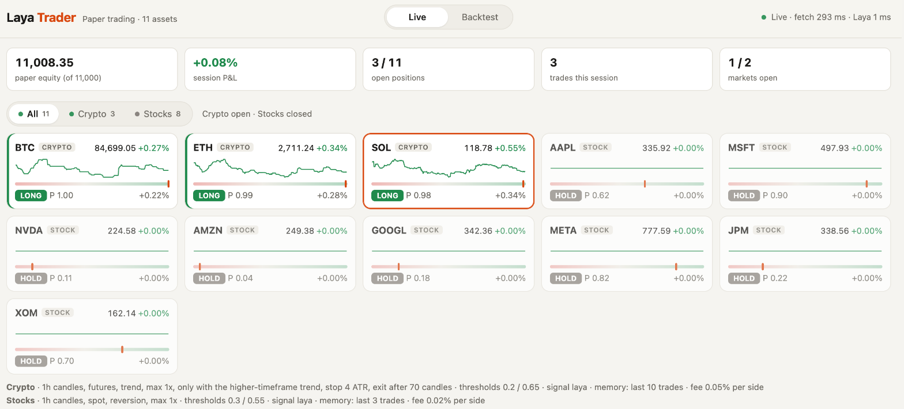
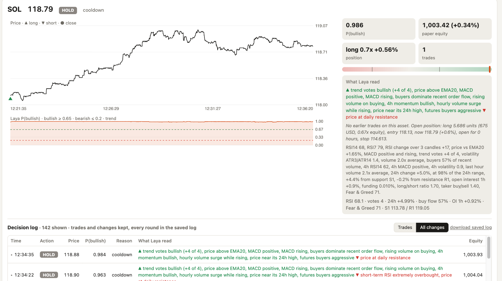
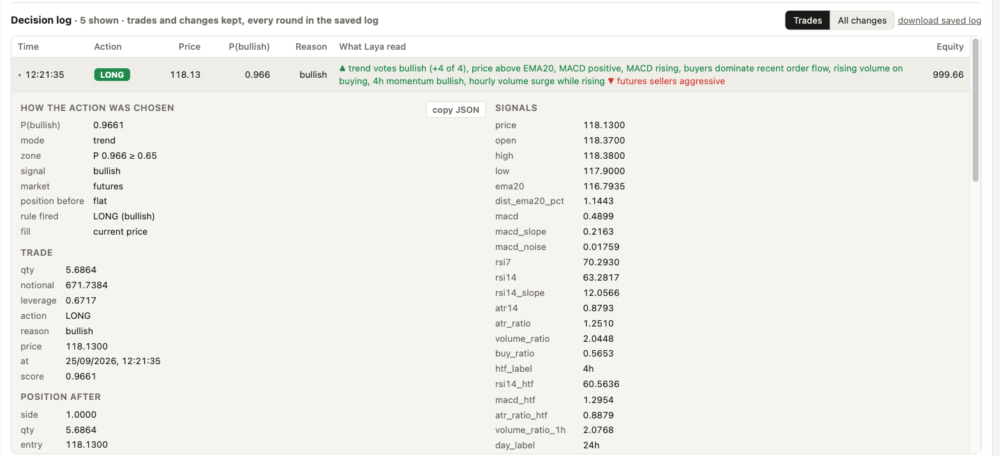
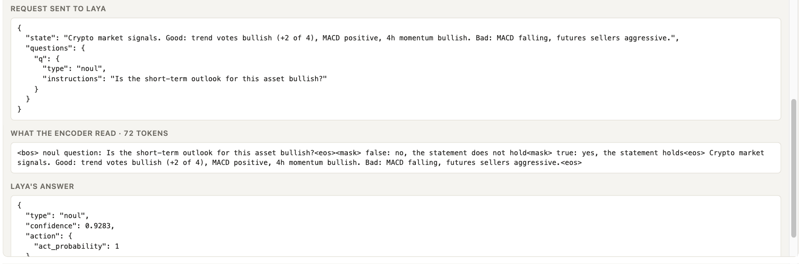
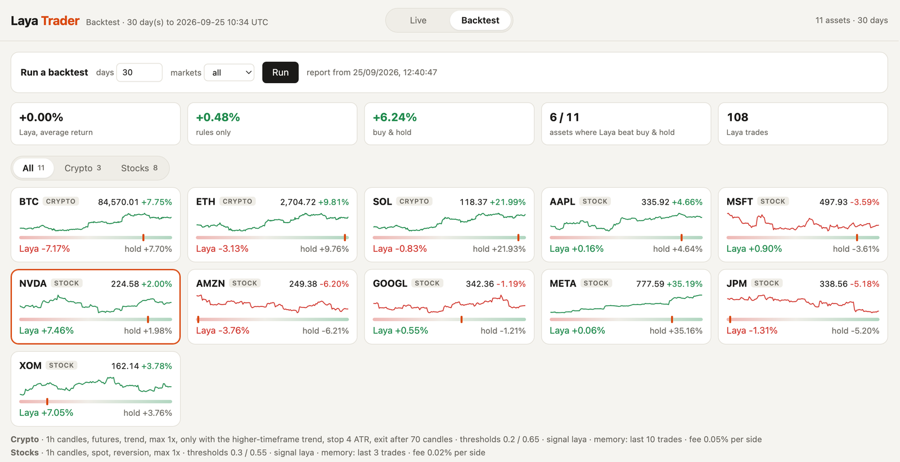
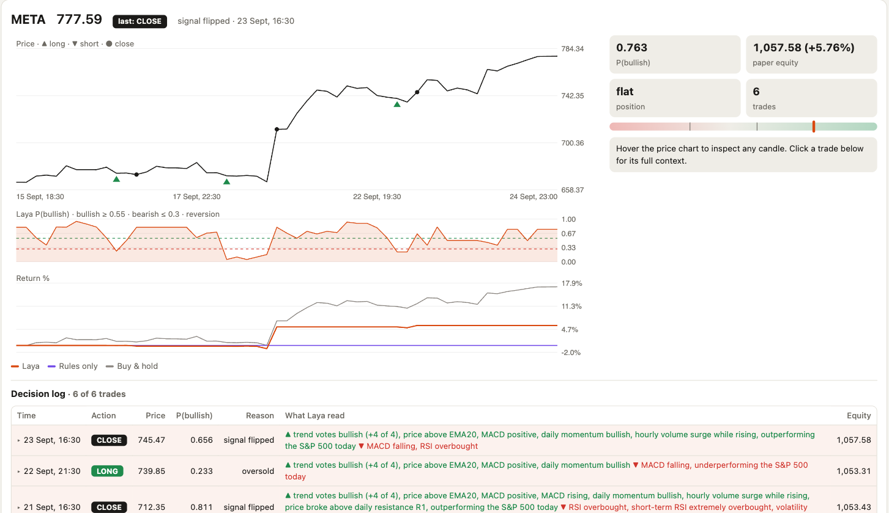

# laya-trader

Paper trading with a small local AI model. Every second, [Laya MLX](https://github.com/mizorewww/laya-mlx) reads market signals for **crypto** (Binance) and **S&P 500 stocks** (Yahoo Finance) and answers one question: *is the short-term outlook bullish?* A strategy turns that probability into **LONG**, **SHORT**, **CLOSE** or **HOLD** on a paper account. A live dashboard shows every decision and exactly what Laya read.

**[▶ Live demo on Hugging Face](https://huggingface.co/spaces/antonellof/laya-trader)**: the dashboard running in the cloud, live trades and a 30-day backtest refreshed daily.

**Paper trading only.** No API keys, no orders, nothing is sent to an exchange or broker. Not financial advice.



## Contents

- [What it is](#what-it-is)
- [Quick start](#quick-start) · [online demo](#online-demo-hugging-face-space)
- [How it works](#how-it-works)
- [Dashboard](#dashboard)
- [Configuration](#configuration)
- [Results so far](#results-so-far)
- [Research tools](#research-tools)
- [Files](#files)
- More detail: [HOW-IT-WORKS.md](docs/HOW-IT-WORKS.md) · every experiment: [RESEARCH.md](docs/RESEARCH.md)

## What it is

- **A live paper trader** for 3 coins and 8 large US stocks, running on your Mac with no cloud and no account.
- **Laya** is a typed-decision model: it doesn't generate text. It reads a short description of the market and returns a probability in one forward pass, in about 15 ms on Apple Silicon.
- **A strategy layer** turns that probability into trades, with position sizing, leverage caps, stops and cooldowns set per market.
- **Research tools** that pick the prompt and the strategy from evidence: backtests, a prompt lab, and walk-forward tests on data the strategy never saw.

It's an experiment. The results so far are honest and mixed; see [Results so far](#results-so-far).

## Quick start

Needs an Apple Silicon Mac, macOS 14+, and [uv](https://docs.astral.sh/uv/).

```bash
git clone https://github.com/antonellof/laya-trader
cd laya-trader
./run.sh
```

The first run downloads the Laya checkpoint (~650 MB). The dashboard opens at **http://127.0.0.1:8765**, and every decision is saved to `logs/decisions-<date>.jsonl`. Stop with Ctrl-C.

Backtests: open the **Backtest** tab in the dashboard, pick the days and press **Run**, or from the terminal:

```bash
uv run python backtest.py --days 30              # all markets, writes backtest.html
uv run python backtest.py --days 30 --markets stocks
```

### Online demo (Hugging Face Space)

Live: **[huggingface.co/spaces/antonellof/laya-trader](https://huggingface.co/spaces/antonellof/laya-trader)** (read-only; the Backtest tab shows the latest daily report).

`./deploy_space.sh` publishes a read-only copy of the dashboard to a free Hugging Face Space (Gradio SDK on ZeroGPU hardware; `space/app.py` launches Gradio and routes the dashboard through its server). There, Laya runs on the CPU with its [PyTorch runtime](https://github.com/NandhaKishorM/laya) and the same weights, one round every 10 seconds, and the Space rebuilds a 30-day backtest daily (the deploy uploads your latest local `backtest.html` to show until then). Needs `uv run hf auth login` with a write token. Nothing persists: the paper account restarts with the Space, which sleeps after two days without visitors. On Linux, `core.py` picks the PyTorch runtime automatically (`LAYA_BACKEND=torch` or `mlx` to force one).

## How it works

```
market data ──► signals ──► one sentence ──► Laya: P(bullish) ──► strategy ──► LONG / SHORT / CLOSE / HOLD
Binance, Yahoo   RSI, MACD,   "Good: … Bad: …"   local, ~15 ms       thresholds,    paper account,
                 volume, …    (+ values, memory)                     size, exits    log, dashboard
```

1. **Data.** Public endpoints only. Crypto: Binance candles and futures statistics, Fear & Greed. Stocks: Yahoo Finance candles during the US session, VIX, SPY for relative strength.
2. **Signals.** RSI, MACD, EMA trend, volatility, volume and order flow, higher-timeframe momentum, daily support/resistance, open interest and funding (crypto).
3. **The sentence.** Signals become plain words: *"Good: MACD positive, buyers dominate. Bad: RSI overbought."* Crypto also gets the raw indicator values and a memory of Laya's recent trades and open position; stocks get a shorter memory.
4. **Laya's answer.** One yes/no question returns P(bullish).
5. **The strategy.** Per market: follow the signal (crypto) or buy the dip (stocks), size from risk, cap leverage, optional stops, time exits and cooldowns.

Full details, including every signal and rule: [HOW-IT-WORKS.md](docs/HOW-IT-WORKS.md).

## Dashboard

- **Filter** above the asset tiles: All (default), Crypto or Stocks, with a live dot when that market is open.
- **Tiles** show price, a sparkline, P(bullish), the position (green or red edge when open) and equity.
- **Click a tile** for its charts, the position and what Laya read: signal summary, memory and values.
- **Decision log**: trades and signal changes. Click a row for the full context: the rule that fired, every signal, the exact request sent to Laya, the tokens its encoder read, and its answer.
- **Backtest tab**: the latest report, with each asset against rules-only and buy & hold.











## Configuration

Everything is in [`config.toml`](config.toml), with one section per market. The settings you're most likely to change:

| Setting | Crypto | Stocks | What it does |
|---|---|---|---|
| `symbols` | BTC, ETH, SOL | AAPL, MSFT, NVDA, AMZN, GOOGL, META, JPM, XOM | what to trade |
| `kline_interval` | 1h | 1h | candle size for the indicators |
| `strategy.market` | futures | spot | futures allow shorts and leverage |
| `strategy.direction` | trend | reversion | follow the signal, or buy the dip |
| `strategy.max_leverage` | 1 | 1 | 2× and 3× lost heavily in tests |
| `strategy.risk_pct` | 1.5 | 3.0 | position size (% of equity at risk) |
| `strategy.stop_loss_atr` | 4 | 0 (none) | stop distance; stops hurt stocks in tests |
| `strategy.cooldown_seconds` | 7200 (2h) | 3600 (1h) | minimum time between trades |
| `format` | detailed | good_bad | sentence wording (with or without values) |
| `memory_trades` | 10 | 3 | recent trades Laya reads |

All settings, with defaults and explanations: [HOW-IT-WORKS.md → Configuration](docs/HOW-IT-WORKS.md#9-configuration-configtoml).

## Results so far

Tested on months of hourly data the strategies never saw during tuning:

| | Laya strategy | Buy & hold |
|---|---|---|
| **Stocks**, 8–20 names, 9 months | about +10–12% | +12–18% |
| **Crypto**, 3 coins, 9 months | positive: +6% to +26% depending on settings and run | −8% to −12% |

- **Stocks:** Laya earns less than holding in a rising market, but its worst months were a fraction of buy & hold's (e.g. −0.7% vs −4.3%).
- **Crypto:** positive in a year when holding lost money, with worst drawdowns around −10% instead of −40%.
- **What didn't work:** fast trading on 1–15 minute candles (fees), leverage above 1×, tight stops, and any stop on stocks.
- **What was dropped:** re-tuning every month, and detailed wording or memory on stocks.

- **Last 30 days** (to 25 Sept 2026, a rising month, current settings): crypto −3.7% on average against +13.1% for buy & hold. Stocks made +1.4% against +3.7%, with smaller drawdowns.

**Caveat:** single results move a lot between runs a few hours apart, and a single month can go against the longer tests. Trust the direction of an effect, not the exact percentage.

All experiments and tables: [RESEARCH.md](docs/RESEARCH.md).

## Research tools

| Command | What it does |
|---|---|
| `backtest.py --days N` | replays history with the live logic; compares Laya, rules only and buy & hold |
| `promptlab.py` | scores candidate questions and wordings by how well P predicts the next move |
| `walkforward.py` | searches strategies on older data and tests them on newer data |
| `walkforward.py --rolling` | the same, month by month over a year (`--variants risk / memory / futures / speed`, `--formats good_bad,detailed`) |

Run them with `uv run python <command>`.

## Files

```
config.toml     markets, assets, prompt, strategies, paper account
laya_trader.py  live loop and dashboard server
dashboard.html  the dashboard (live and backtest)
markets.py      data: Binance (crypto) and Yahoo Finance (stocks)
core.py         indicators, the sentence, Laya's question, strategy, paper account
backtest.py     historical replay and report
promptlab.py    prompt comparison
walkforward.py  strategy search and out-of-sample tests
deploy_space.sh publish the dashboard to a Hugging Face Space (files in space/)
docs/           HOW-IT-WORKS.md, RESEARCH.md, screenshots
```
